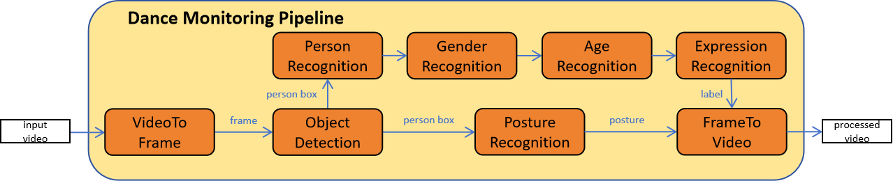

# This is a dance pipeline project code.
The correct code is stored in [lifang535/dance](https://github.com/lifang535/dance/tree/master).
  
Mainly including **VideoToFrame, ObjectDetection, PostureRecognition, PersonRecognition, GenderRecognition, AgeRecognition, ExpressionRecognition and FrameToVideo.**  



## Dance Monitoring Pipeline

The modules are in `dance/module`:

- `VideoToFrame`: Extracts frames from video, and sends them to `ObjectDetection`.
- `ObjectDetection`: Detects persons, and sends them with boxes to `PostureRecognition` and `PersonRecognition` respectively.
- `PostureRecognition`: Reads the posture in the box of the frame, and sends frame with box and label to `FrameToVideo`.
- `PersonRecognition`: Recognizes the face in the box of the frame, and sends frame with box and label to `GenderRecognition`.
- `GenderRecognition`: Recognizes the gender in the box of the frame, and sends frame with box and label to `AgeRecognition`.
- `AgeRecognition`: Recognizes the age in the box of the frame, and sends frame with box and label to `ExpressionRecognition`.
- `ExpressionRecognition`: Recognizes the expression in the box of the frame, and sends frame with box and label to `FrameToVideo`.
- `FrameToVideo`: Collects frames with boxes, labels and postures, and combines them into a video.

## Model Source

- `ObjectDetection`: [YOLOs Tiny](https://huggingface.co/hustvl/yolos-tiny)
- `PostureRecognition`: [Openpose](https://github.com/Hzzone/pytorch-openpose)
- `PersonRecognition`: [Face Recognition](https://github.com/ageitgey/face_recognition/tree/master)
- `GenderRecognition`: [Gender Recognition](https://huggingface.co/rizvandwiki/gender-classification-2)
- `AgeRecognition`: [Age Recognition](https://huggingface.co/nateraw/vit-age-classifier)
- `ExpressionRecognition`: [Expression Recognition](https://huggingface.co/trpakov/vit-face-expression)

## Quick Start

Install the required libraries:

``` bash
$ pip3 install -r requirements.txt
```

Adjust configuration in `dance/module/configs.py`.  

Execute:

``` bash
$ cd module
$ python3 pipeline.py
```

Then, the pipeline will read the videos from `dance/input_video`, process them, and save the processed videos in `dance/output_video`.

## Docker

*Note: This is an image of the traffic monitoring pipeline. Please make sure to clone the dance monitoring pipeline repository first.*

### Search for the Docker image:

``` bash
$ docker search traffic_monitoring_pipeline
```

### Pull the image:

``` bash
$ docker pull lifang535/traffic_monitoring_pipeline_with_git_v3
```

### Create and run the container:

``` bash
$ docker run --gpus all -it --rm --name temp traffic_monitoring_pipeline_with_git_v3
```

### Pull the repository:

All dependencies have been installed. Execute the following commands:

``` bash
$ cd /
$ git clone https://github.com/lifang535/dance.git
```

### Execute the pipeline:

Execute:

``` bash
$ cd dance/module
$ python3 pipeline.py
```
